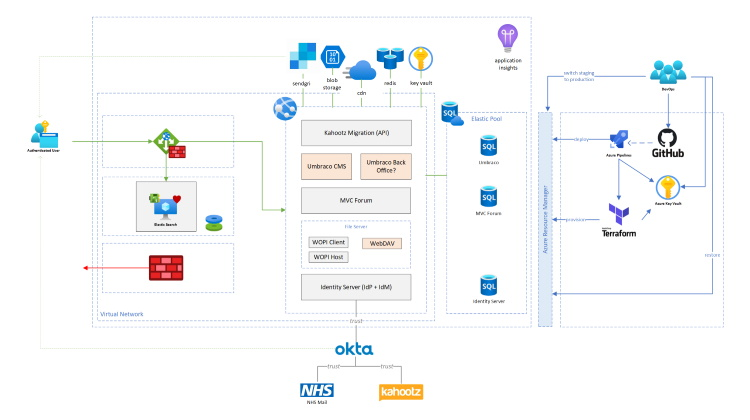

# Architecture

## High Level Base Overview

It is still early days, but thus far we have an approach that we believe is a good starting point for the automated deployment and hosting of the platform.  This may evolve as we learn more and add further capabilities.

We believe this design captures the minimum safe *requirements* for a scale-up deployment of the platform.  For scale-out deployments, please refer to the [specific documentation](./scale-out) on that topic.    

The FutureNHS platform is designed for different environments with progressive capabilities, however, it is important to us that each can still evolve independently to meet the needs of the specific host.  To this end, the reader should consider that any further topology discussed herein is optional for the base case, and good practice for the more mature roll out.

## Automated Deployment

The deployment of infrastructure in our environments is fully automated, and has been since Day 1.  We run [Azure Pipelines](https://azure.microsoft.com/en-gb/services/devops/pipelines/) that are triggered each time a relevant release is successfully built, analysed, verified and tested.  We use [Terraform](https://www.terraform.io/) to determine the changes we need to make to the underlying topology and to communicate with the relevant Azure Resource Managers. [Checkov](https://www.checkov.io) is our static analyser of choice which we use to help us identify any security related concerns in the deployment scripts that we might have missed during review.

Deployments work their way up through various closed environments to production, each one acting as a gateway to the next and imposing ever stricter entry criteria than the last.

Example deployment scripts and further information on this approach can be found in our sister [infrastructure](https://github.com/nhsengland/futurenhs-infra) repository. 

## Change process and approvals

See [Governance documentation](../governance/README.md).