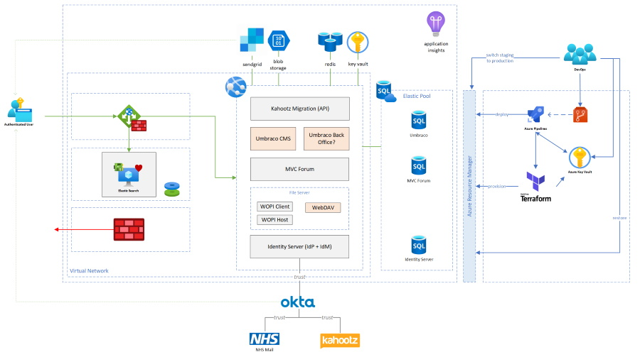

# FutureNHS Development Environment

Our own development environments are essentially NHS specific extensions to the [base architecture](../README.md).

## Kahootz

We have integrated with [Kahootz](https://www.kahootz.com/); an online collaboration platform already used by the FutureNHS team.

## Continuous Integration and Deployment

We have added automated build and deployment pipelines by way of best practice.

You can find more information on the how and why in our [continuous integration](../../continuous-integration/README.md) and [continuous deployment](../../continuous-deployment/README.md) sections.

## Identity

We have extended Identity Server to federate with [Okta](https://www.okta.com/) as the preferred Identity Provider (IdP).  This enables users with a Kahootz or NHS Identity (Mail) account to register with and then access our platform using [Single Sign-On](https://en.wikipedia.org/wiki/Single_sign-on).  You can find more information on why we chose this particular approach in the [Identity section.](../identity/README.md)