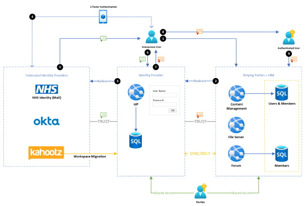
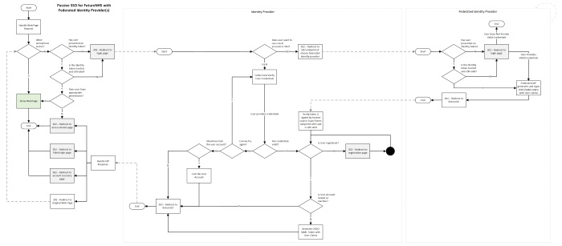

# Identity

Reliably identifying the context in which a unit of work executes is key to ensuring our platform is safe, testable, resiliant and thus operating as designed.

In the Beta timeframe we are mainly focused on the identity of the user consuming/generating content.  In the future, we expect to offer extensibility points and expand on the notions of 'identity' and 'context'.

## User Identity

FutureNHS is a closed platform and only accessible by trusted users who have been invited to take part (at least for now).  Given this, and the nature of the content being shared in such an environment, it is imperative that access is appropriately restricted where needed.

'Identity' is a highly technical and very specialised area and we are first to admit that we do not have these expert skills readily available in our development teams to 'roll our own', therefore we have taken the decision to defer to proven third parties that are audited to assure their credentials.  From here-on-in, we will refer to these parties as either Identity Managers (IdM) or Identity Providers (IdP).

The IdP is the entity that is trusted to assure the user is indeed whom/what they claim to be.  There are of course numerous different techniques to try to gain such assurance, and none is infalable, thus we must be somewhat pragmatic and reconcile with the idea that not all risks are equal (threat modelling).  Some areas of the platform may employ a stricter set of entry criteria and thus the accepted approach taken for user identification will be more difficult to forge.  The platform will therefore communicate to assure only the most appropriate approach is taken given the expected use case.  Some may accept a simple username/password pair, while others may require two-factor authentication or perhaps even some sort of biometric confirmation or exchange of a cryptographically signed piece of evidence.  

In short, features of the platform will be protected by a combination of first assuring the user's identity followed by an assessment as to whether that user is authorised to actually perform the activity in question. 

## Trust

**If we are deferring to a remote third party, how can we trust what 'they' tell us given the distributed nature of the internet and the numerous opportunties along the way for a bad actor to spoof the identity of either the user, the IdP or the IdM?**

Again, we return to the pragmatic view of risk and thus the goal is not to assure we are building an infallable system, but rather to make is difficult to breach such that the cost of doing so far outways the reward.  

This is a multi-pronged approach in which identity discovery is one part.

We establish 'trust' with the IdP by exchanging secret key(s) with them that they store very securely in their own environment.  These secret keys are actually one half of a pair and we keep the other half secure and share it with nobody.  The IdP will use these private keys to asymmetrically encrypt and sign the data they've produced for us.  When we receive the data inside our own secure network, we use our half of the secret key (public key) to decrypt the message.  That's not quite the whole story because there is always the possibility of a man-in-the-middle acquiring the same public key and changing the data as it moves over the iternet.  To mitigate this risk, the original message is signed by the IdP using in part some/all of the data in the message and we can thus validate said signature and ensure the data is as it was when sent by the trusted party.  This process is referred to a non-repudiation.

## Single Sign On

Relying on a third party IdP has many benefits, one of which is that if the user has already authenticated with them then there is no need for them to do so again for us (subject to the policies of the IdP).  This is a process termed Single Sign-On (SSO) and is often almost transparent to the user accessing a passive application such as ours.  In a basic sense, it can be an opportunity for users not to have to remember/manage a different password for each web application/site they access and thus choosing to put in place an extensive authentication process that can be quite involved, becomes less of an inconvenience/burden to the user.  The process of switching between associative applications hopefully become pretty much seamless.

The above diagram is a high level overview of how a user's identity is established and passed on to our platform services.  We have decided to host our own Identity Server instance which federates with Okta, which in turn federates with NHS Identity and Kahootz as alternate Identity Providers (although we too might federate directly with them once we understand better the role(s) Okta will take up for the NHS).

*At the time of writing it is unclear how extensively we will use Okta and if it will become our IdM.  Presently, given we have taken existing software out-of-the-box to build our platform, each component has it's own notion of a user and their profile.  Each is constrained by that components specific view of the world which has both pros and cons for us.  We are comfortable letting this piece of the design evolve for now, given we don't yet have a firm grasp of the direction the NHS will take Okta in, but are inclined to stand up the IdM as a separate component so as not to force collaborators/users of the code base to take a commercial dependency on Okta too.  Quite whether we need to address this in the Beta timeframe will become clear as we progress.*

The above flow chart depicts the identity discovery process (with SSO) and shows the decisions and processes that need to be considered.  It's a non-exhaustive overview produced with the intention of giving a little more detail of the approach we've taken in the first instance.  Other processes such as user on/off boarding need to be considered to appreciate the full picture, but here is the essence of the main flow.