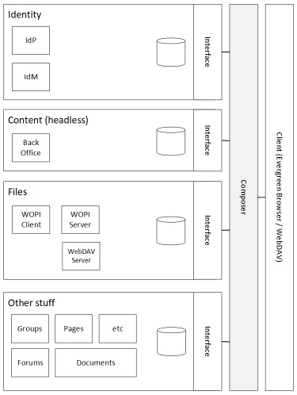

# The Scale-Up Approach

We wouldn't go so far as to label this approach Monolithic, but it's most certainly the architectural style the most closely aligns with our Scale-Up approach.

The reason it's not really an n-tier monolith is because we are cloud-first at heart and have one squinty eye looking toward the end-state architecture we will need to dog-food the platform inside the NHS.  Where there is an opportunity to align our thinking in that direction without adding any complexity/risk to the Beta deliverables we will opt to do so.

Our desire to try and use as much existing open-source software as possible also naturally takes us away from a full blown monolith.  We are adopting opinionated solutions and thus sometimes *constrained/directed* by the decisions those developers took.  That is not to suggest we consider them to be restrictive, more navigators for the first part of our journey and without whom we'd never arrive in time to jump aboard the next carriage.  Hopefully they will stay with us for the whole ride, but for now, out-of-the-box means isolating these components from each other, and where integration is required, we aim do so using platform agnostic protocols; keeping components decoupled along all dimensions is the preferred outcome, with post-Beta risks kept to a minimum.

In essence, these are the first few steps we have taken towards a Service-Orientated Architecture.  We haven't gone so far as to have each component independently deployable and all that other good stuff, but they most certainly could be if we identify value in doing so.  There are however, areas in which our own processes first need to mature before we can travel to such a place, and our backlog suggests focus should lie elsewhere for now.

This 'isolation' approach also naturally presents opportunities to swap components in/out should we find it necessary to do so.  Most likely this will be for technical reasons, but it is hoped as the platform grows and an ecosystem develops around it, there will be opportunities for those running with it to reconfigure areas of the platform to better suit their own needs.  Hopefully, they too will share the fruits of their labour.

## A pseudo SOA (our journey of 1000 steps)

We have a small number of big-box components where we have either picked up existing open-source components and run with them, or decided to craft our own (failed to find/understand an alternative).  We might stretch our architecture lexicon a little and claim these to be our first set of Services.

The above image depicts a simplified high-level overview of where we are.  We have a small number of components that provide Identity, Content and File management functions.  Each has a clear responsibility, publish their own platform agnostic interface(s), and each handles their own data.  For readers familiar with the concepts of [Domain Driven Design](https://www.dddcommunity.org/learning-ddd/what_is_ddd/), we think of each of these blocks as a potential [Bounded Context](https://www.martinfowler.com/bliki/BoundedContext.html) that we can later explore the merits of.  There will undoubtedly be opportunities along the way to discover other such candidate services/contexts, but for now this is a good place to start and we might even start to consider each as a progressive enhancement and thus open the door to defining different service level objectives/agreements for them.

## Logical and Physical are not the same thing

Logically these are individual components/services with a clear delineation of responsibility, but this doesn't mean they have to be physically deployed to different 'machines'.  In our cloud environments, we actually do keep them physically separate, but we also develop locally and can thus essentially emulate the single-server environment in doing so.

## The Composer

We're developing something akin to a gateway service where all our composition takes place (server side).  For now, we consider this our quickest, safest route to success and for the purpose of this document we probably are best served thinking of it as just another component, however, the reality is that this is our *monolith*.

## Scaling Up

In theory, we can scale-up each of these individual components independently.  In practice, we're not in a place where we could do so safely given these are not fully autonomous services and there is a clear dependency chain meaning as one unit scales, so must those things it depends on.  Of course, given we consider these progressive capabilities, we have the beginnings of a design that can cleanly degrade when a piece of it becomes temporarily unavailable, but there is still a long way to go to realise such an architecture.

This means, for now, the maximum throughtput of the overall system is limited by the amount each key component can scale.  Given, out-of-the-box, some of these components are written to run against a single relational database instance with none idempotent CRUD operations, no partitioning and no protection from in-flight intermittent topological faults, we are *limited* by how much work the single database can do and how resilient the underlying topology is.  Of course, this will improve over time and we will contribute to improve these solutions to support retry semantics, idempotent operations, stateless partitions and the like.  These details will be addressed in our alternate [scale out](scale-out.md) architecture.

## Benchmarking

Given the physical/financial limitations of a scale-up approach, it is in our best interests to fully understand exactly what each upwards step delivers for the extra costs incurred, for at some point, we reach a place where either the costs of hosting are prohibitive or the amount of ooomph we can deliver with each increment is no longer enough to assure we can meet our non-functional requirements.  For example, acquiring enough horse-power to support X concurrent users will come in at a certain cost per operation.  We may be able to support another X users without boosting the underlying *hardware* in which case the CPO drops, however at some point we may need to acquire the latest super-dooper piece of *hardware* to add another X users and now CPO is moving in the wrong direction.  Eventually, there is no more ooomph to be delivered.

Logically at that point (and hopefully earlier), rather than using the vanilla cloud services on offer, we turn our attention towards virtualisation/containerisation to deliver more bang for our buck.  We would have enough traffic to warrant reserving our own capacity (even for our serverless pieces) rather than sticking with a consumption based model.

The point here is that unless we constantly benchmark our platform as it grows, we would be working blind when trying to plot when and where we can next expect our cloud costs to increase.  Better we already know when the next change will be needed and proactively ensure we are ready before that moment arrives.

To this end, we aim to add *continuous* load-testing to our software development lifecycle for the forseeable future.  We will aggregate metrics to keep track of and project future Cost Per User KPIs as we go, and we will publish them so we can target those areas of the platform where a rework can bring this cost down, and so those wishing to utilise our platform have a solid grasp of the associated infrastructure costs; something we've always found difficult to project accurately.