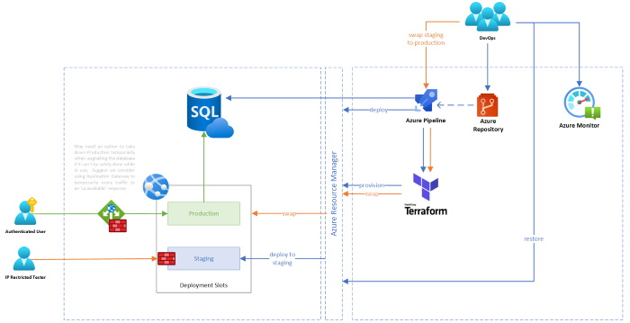

# Continuous Deployment

Please [refer to this documentation](../governance/README.md) to understand how we distiguish between deployments and releases.

The acquisition of infrastructure and deployment of *code* to our environments is fully automated, and has been since Day 1.  We run [Azure Pipelines](https://azure.microsoft.com/en-gb/services/devops/pipelines/) that are triggered each time a relevant release is successfully built, analysed, [verified and tested](../testing).  

## Infrastructure Deployments

We use [Terraform](https://www.terraform.io/) to determine the changes we need to make to the underlying infrastructure and to communicate with the [Azure Resource Manager](https://azure.microsoft.com/en-gb/features/resource-manager/).  We have structured our scripts as modules and will eventually move to use [Terragrunt](https://github.com/gruntwork-io/terragrunt) to improve our [DRY](https://en.wikipedia.org/wiki/Don%27t_repeat_yourself) credentials and make the scripts easier to manage.  The [Terraform](https://www.terraform.io/) state file for each environment is securely stored in Azure separate from the FutureNHS environment, encrypted at rest and in transit, versioned on write and replicated across Azure Regions for backup/recovery.

[Sealed secrets](../sealed-secrets/README.md) are deployed to an environment specific, access restricted [Azure Key Vault](https://azure.microsoft.com/en-gb/services/key-vault/) for safe storage.  Examples of such might be database accounts and passwords, certificates used for encryption and 3rd party license files.  Where users and passwords are needed, these will be randomly generated during each deployment and stored in the key vault.  Likewise, the regular production and rotation of certificates is automated.  We use [LetsEncrypt](https://letsencrypt.org/) to produce all of our TLS certificates.  If any secrets are required during build/deployment, these will be inject from the same key vault instance and all references in any trace output will be obfuscated.

[Checkov](https://www.checkov.io) is our static analyser of choice.  We use it to help uncover any security specific concerns  that we might miss during peer review.

## Blue/Green Staged Deployments

We have adopted the [blue/green methodology](https://en.wikipedia.org/wiki/Blue-green_deployment) for staging deployments of Azure App Services in all of our environments, in order to maximise availability of the platform to our end users.  Switching is of course fully automated through [Terraform](https://www.terraform.io/) once all the appropriate testing has completed successfully.

Over time, we fully intend to extend this approach to include the deployment of other assets such as virtual machines using the native continuous-delivery option in Azure.  We have still to conclude our preferred approach for database upgrades given the use of 3rd party components that have their own opinionated approaches that still need to be overcome.  Ideally, we would investigate the use of [Azure Traffic Manager](https://azure.microsoft.com/en-us/services/traffic-manager/) or [Azure Front Door](https://azure.microsoft.com/en-gb/services/frontdoor/) to help us out but may discover our options are a little more limited and that we have to rely on scripted changes or techniques using something like [Data-Tier Applications](https://docs.microsoft.com/en-us/sql/relational-databases/data-tier-applications/data-tier-applications?view=sql-server-ver15), [Liquibase](https://github.com/liquibase/liquibase) or [SQL Change Automation.](https://www.red-gate.com/products/sql-development/sql-change-automation/) for in-place updates.

Deployments work their way up through various closed environments to production, each one acting as a gateway to the next and imposing ever stricter entry criteria.  Once a deployment has passed production specific tests, it will be released to the end users.

## Further Information & Examples

Example deployment scripts and further information on this approach can be found in our sister [infrastructure](https://github.com/nhsengland/futurenhs-infra) repository. 