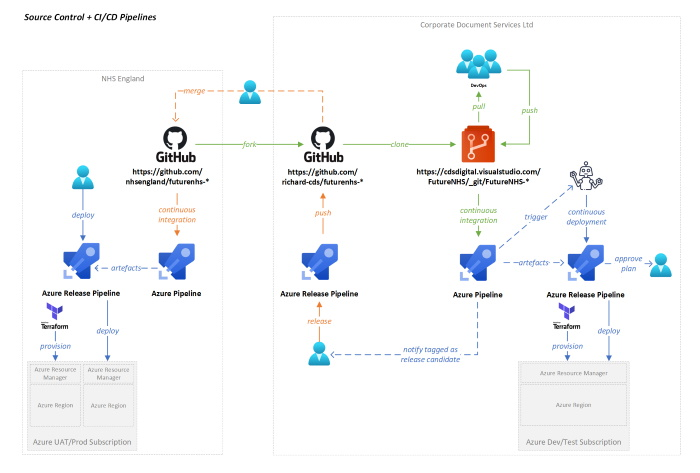

# Continuous Integration (CI)

Our CI approach is perhaps a little unintuitive, mainly because as an open-source project we welcome contributions from anyone.  Of course, this has to be balanced with our use of 3rd parties developers who are contracted to deliver certain capabilities on our behalf, who will most likely wish to host their own development environments and later merge with the main branch of our codebases.

## Third Parties and Local Continuous Integration

By way of example, here is the model used by [Corporate Document Services Ltd (CDS).](https://www.cds.co.uk/)

CDS prefer to host their own [Azure DevOps](https://azure.microsoft.com/en-gb/services/devops/) instance in which they have multiple FutureNHS specific repositories their development teams are working on.  This gives them the freedom to optionally use their own proprietary technologies to assure they follow a robust software development lifecycle that suits their structure, and to benefit from other Azure DevOps tooling.  It also makes is simpler for them to manage access to project artefacts and licenses etc.

CDS host their own *local* development and testing environments, through which all deployments must flow before being considered suitable candidates for merging with the FutureNHS owned repositories.  Generally speaking, CDS look to push new code out to FutureNHS at the end of each Sprint (3 week cycle).

As you can hopefully see in the above diagram, CDS have [forked the FutureNHS repositories](https://github.com/Richard-CDS/futurenhs) into their own public GitHub repos from where they are subsequently cloned into their private Azure DevOps instance.  Their DevOps team pulls from this instance to work locally on the codebase.  At some point, their changes are merged with their 'main' branch and custom CI pipelines are triggered to build, verify and test the changes.  All changes are of course covered by appropriate automated tests.

The successful [build pipeline](cds-build-pipeline-example.md) generates artefacts that are subsequently made available for further testing/analysis and deployment.  

Where the changes made refer to the underpinning infrastructure, Terraform scripts are produced.  These artefacts are picked up by [another pipeline](cds-infra-pipeline-example.md) and run through a number of [static checks](cds-infra-pipeline-example.md#static-checks) to catch any security concerns that may not have been uncovered during peer review.  Assuming all is ok, a [deployment plan](https://geekflare.com/terraform-for-beginners) is generated and made available for review by a senior infrastructure engineer.  If the plan is approved, the release pipeline continues and the necessary infrastructure changes are made before the *code* is deployed.

At the end of a Sprint, the current codebase may be tagged as an 'internal release candidate'.  This essentially means CDS consider this to be of suitable quality to push out to the FutureNHS respository.  By way of an interim step, all tagged code is first pushed back out to the CDS owned GitHub repositories (originally forked from FutureNHS) and subjected to further analysis.  [This process is automated](cds-github-push-example.md), again using Azure Pipelines.  Eventually this may prove to be an unnecessary step and will therefore be removed, but until we better understand how multiple 3rd party contributors will collaborate, CDS have erred on the side of caution in adopting this approach.

Once in the CDS GitHub repository, the process of merging with the FutureNHS codebase will start.  Once successful, our own Continuous Integration and Deployment process begins and the code will be subjected to the relevant amount of testing for assurance before finally being released to our own Production environment.