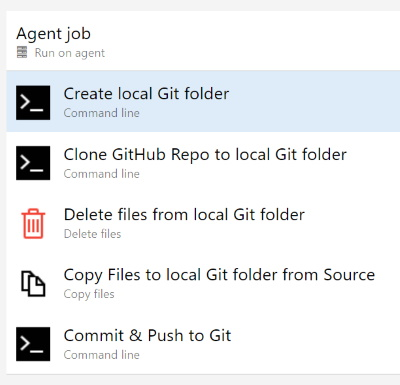

# CDS Automated Push to GitHub Repository Example

Where it is possible to do so, [CDS](https://www.cds.co.uk) take the attitude that it is better to automated those tasks that are most often repeated.  Pulling code from a local Azure DevOps repository and pushing it over to a GitHub repository is one such task and this document captures how they achieve this.

## Azure DevOps Pipeline

*It is assumed that the reader has a working knowledged of Azure Pipelines.  If this is not the case, there is an excellent overview to be found in the [Microsoft Documents website](https://docs.microsoft.com/en-us/azure/devops/pipelines/get-started/what-is-azure-pipelines).*

CDS use a release pipeline to manage the set of tasks shown below, and encapsulate the same within a single agent job:-



The agent specification is set to 'vs2017-win2016', and the pipeline pulls the code to push over to GitHub from the appropriate Azure DevOps Repository.  Change the alias for this artefact to _REPO-Artefact.

### Variables

The placeholder variables referenced in the tasks are to be replaced with values as follows:

- git.user.name: The user name of the git account that created the repo you are going to push the code to : eg Richard-CDS
- git.user.email: The email address associated with the above $(git.user.name) account
- git.user.personalAccessToken: The access token for the $(git.user.name) account.  If you are unsure where to find this, please see the section at the end of this document.
- git.branch.name: The branch from which the code is initially cloned and then subsequently pushed to - e.g. main
- git.origin.url: The url of the git 'origin'; ie the address of the repository : eg https://github.com/Richard-CDS/futurenhs-infra.git
- git.repo.name: The name of the repo without the .git extension - e.g. futurenhs-infra
- git.commitmsg: The message you want to include in the commit.  You could changet this to pull from the commit that fired up the pipeline if using continuous triggers.

### Task 1: Create local Git folder

This is a simple command line task that simply creates a new folder for us to work in and names it 'git'.

```
mkdir git
```


### Task 2: Clone GitHub Repo to local Git folder

Another command line task.  This time, we want to clone the remote git repository inside the folder we just created.  This is so we can overwrite the files with the versions in our DevOps repo and push them back out.

This task must run inside the new folder, so remember to change the Working Directory to $(System.DefaultWorkingDirectory)/git


```
git config --global user.name $(git.user.name)
git config --global user.email $(git.user.email)

git config --global init.defaultBranch $(git.branch.name)
   
git init

git remote add origin $(git.origin.url)

git clone $(git.origin.url)
```


### Task 3: Delete file from local Git folder

This task clears out everything we cloned from the target repository.  We are going to replace them with our own version.

The Source Folder for this task is $(System.DefaultWorkingDirectory)/git/$(git.repo.name) where $(git.repo.name) is set to the name of the repository you referenced in the previous task using $(git.origin.url).  Remember to omit the .git piece, so in our example this would become futurenhs-infra.

The Contents field shoult be populated with * so that all folders and files are deleted.


### Task 4: Copy Files to local Git folder from Source

This task is going to copy the folders and files from our source DevOps repository and copy them into our $(System.DefaultWorkingDirectory)/git/$(git.repo.name) folder.  Remember to set the Target Folder to this value.

The Source Folder should be set to $(System.DefaultWorkingDirectory)/_REPO-Artefact and the Contents to * so everything is copied.


### Task 5: Commit and Push to Git

The final command line task takes the files and folders we just copied and pushes them out to the appropriate branch in the remote git instance.

```
git add .
git status

git commit -m $(git.commitmsg)

git push -f https://$(git.user.personalAccessToken)@github.com/$(git.user.name)/$(git.repo.name).git
```

As you can see, this code is specifically referring to GitHub.  If you use a different git, please remember to change the address we push to.


## Personal Access Token for GitHub

You must present the personal access token of the git account you are using to push updates to, and of course, that account must have the appropriate access rights to make contributions to the branch you are targeting.

If you are unsure how to obtain this access token, here is a quick guide.

1. Head on over to GitHub and log in.
2. Click on your account image and from the drop down menu, choose 'Settings'
3. Once the page loads, in the left hand navigation pane you will see a link for 'Developer Settings'.  Click it.
4. Once the page loads, on the left hand side there is a link to 'Personal access tokens'.  Click it.
5. Once the page loads, in the right hand corner is a button labelled 'Generate new token'.  Click it.
6. You will now be asked to confirm you GitHub password again so you can enter 'sudo mode'.  Do so.
7. The token you are about to create will function as an OAuth token and can be used in place of you password.  Add a note so you will remember what this access token will be used for, and make sure you limit the scope of the token as needed (full control of private repositories if you are unsure how best to configure it).  When ready, click on the 'Generate token' button located below the scope options.
8. You will now be shown the token.  Copy this and store it in a safe place because you will not be able to recover it (you would have to revoke/delete it and create a new one).
9. Add the token value as a **secret** variable in your pipeline.  Do not include it in any yaml source code, so you may need to pull it out of an Azure Key Vault instance instead.

That's it.  Your pipeline task should now be able to access your git repository.
