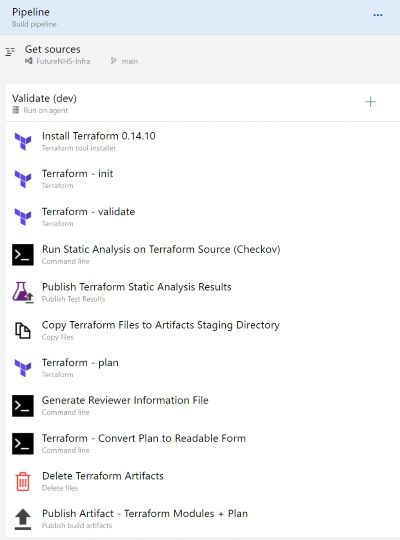

# CDS Infrastructure Deployment Pipeline Example

CDS made the decision to keep the infrastructure acquisition scripts separate from the core repository, mainly to prevent inadvertent changes being made during the development process.  This approach does add a little overhead to the deployment process, but on balance, it is believed the trade offs are offset by the inherent benefits of such a separation.

CDS chose to use [Terraform](https://github.com/hashicorp/terraform) to manage the acquisition, disposal and mutation of infrastructure pieces.  Given they deploy to the Azure Cloud and Terraform's Azure-RM provider is maintained by Microsoft, this seems an appropriate choice, but ultimately, the preference to use Terraform inside the NHS made the choice to align an obvious one.

## Structure of the Repository

As you might imagine, all scripts are managed in a source control repository, the basic folder structure of which looks similar to what is shown below:

-src
  - environment (eg dev, test etc)
    - app-gateway
    - app-services
    - storage
    - elastic-search
    - logging
    - resource-group
    - virtual-network

In the Terraform world, folders are modules that can contain their own scripts and state.  While CDS do consider them modules, state is only held at the environment level and all the modules are referenced in the main.tf root file.  To enforce this, the provider information is only defined in the root.

The state file for each environment is stored in an Azure Storage Blob, held inside a secure container.  It is encrypted both at rest and in transit, versioned on write and replicated across Azure Regions for resilience.  Only authorised persons and managed identities have access to the storage location, which is also independent of the environment being managed (this environment is also managed using Terrafrom scripts outside each project).

Terraform variables (in and out) are marked as secret when appropriate to prevent their values being inadvertently written to any log files.  For example, when a database is procured, we need to generate an admin username and password.  We populate these with randomly generated values (in line with appropriate Azure password policies) and pass them between modules as needed; e.g. to subsequently write them back out to an Azure Key Vault instance so they can be later recovered by interested parties.

e.g. binding to a module inside the root .tf file where output variables from other modules are required 

```js
module "app-gateway" {
  source = "./app-gateway"

  resource_group_name                 = module.resource-group.resource_group_name
  virtual_network_name                = module.virtual-network.virtual_network_name
  network_watcher_name                = module.virtual-network.network_watcher_name

  log_storage_account_id              = module.logging.log_storage_account_id

  log_analytics_workspace_id          = module.logging.log_analytics_workspace_id
  log_analytics_workspace_resource_id = module.logging.log_analytics_workspace_resource_id

  location                            = var.location
  environment                         = var.environment
  product_name                        = var.product_name

}
```

If you are familiar already with Terraform files, you'll note the location, environment and product_name variables are supplied at runtime and thus the same scripts can be used to deploy to multiple Azure Regions (location) and environments (dev, test etc).

The structure of this repository is very much aligned with a monolithic application mindset.  That is to say, we consider the whole application to be deployable rather than say a Microservice approach where each service would have it's own repositories and deployment scripts.  This approach might change in the future when service boundaries are better understood/discovered, but for now CDS find this approach the most efficient way to work. 

# Build Pipeline

The following diagram show the core tasks that would need to be present in an infrastructure build pipeline:-



The pipeline's agent specification is set to 'ubuntu-20.04'.

## Static Checks

There is of course the potential for bugs to creep into any form of code and deployment scripts are no different.  While CDS peer review all code checkins things can get missed and so CDS consider it prudent to automate the analysis of these scripts with a view to catching any security issues.

[Checkov](https://github.com/bridgecrewio/checkov) is their static analysis tool of choice and included in their build pipelines and reporting dashboards.  At the time of writing, Checkov has a growing porfolio of built-in policies that cover security and compliance best practice for Azure deployments.

In the above image, the task named 'Run Static Analysis on Terraform Source (Checkov)' is where we run Checkov.  It's a command line task that runs the following script:-

```
docker pull bridgecrew/checkov:latest

docker container run --env LOG_LEVEL=DEBUG --volume $(System.DefaultWorkingDirectory)/_REPO-Artefact/src/$(environment):/tf bridgecrew/checkov:latest --directory /tf --output junitxml > $(System.DefaultWorkingDirectory)/checkov-report.xml
```

**Note:** the artefact pulled from the repository is named _REPO-Artefact in the pipeline.

The task is fairly simple to follow so long as you have a basic grasp of the [Docker toolset](https://github.com/docker).  

The first command pulls down the latest version of the Checkov docker container hosted on Docker Hub. 

The second command runs the container and maps the environment folder (dev, test etc) containing the terraform files/modules (copied from the repository) to a volume inside the container (called 'tf').  We also tell Checkov to look for the files to scan in the 'tf' directory and ask it to write the test results to an xml file in our working directory (in junit format).  

This test results file is later pushed into the test results dashboard hosted in Azure DevOps by the next task 'Publish Terraform Static Analysis Results'.
